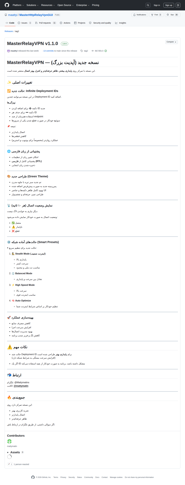

# Visited: https://github.com/maattyi/MasterHttpRelayVpnGUI/releases/tag/tag2
**Time:** Mon May  4 08:11:53 UTC 2026

## Screenshot

## Raw HTML
[page.html](./page.html)

## Downloaded Media (5 files)
## Downloaded Media Files

## Other Links
- [#start-of-content](#start-of-content)
- [/](/)
- [/login?return_to=%2Fmaattyi%2FMasterHttpRelayVpnGUI](/login?return_to=%2Fmaattyi%2FMasterHttpRelayVpnGUI)
- [/login?return_to=https%3A%2F%2Fgithub.com%2Fmaattyi%2FMasterHttpRelayVpnGUI%2Freleases%2Ftag%2Ftag2](/login?return_to=https%3A%2F%2Fgithub.com%2Fmaattyi%2FMasterHttpRelayVpnGUI%2Freleases%2Ftag%2Ftag2)
- [/maattyi](/maattyi)
- [/maattyi/MasterHttpRelayVpnGUI](/maattyi/MasterHttpRelayVpnGUI)
- [/maattyi/MasterHttpRelayVpnGUI/actions](/maattyi/MasterHttpRelayVpnGUI/actions)
- [/maattyi/MasterHttpRelayVpnGUI/commit/6b7d5c3d918cf4297edc606e5a6536eeca8f01d2](/maattyi/MasterHttpRelayVpnGUI/commit/6b7d5c3d918cf4297edc606e5a6536eeca8f01d2)
- [/maattyi/MasterHttpRelayVpnGUI/compare/tag2...main](/maattyi/MasterHttpRelayVpnGUI/compare/tag2...main)
- [/maattyi/MasterHttpRelayVpnGUI/issues](/maattyi/MasterHttpRelayVpnGUI/issues)
- [/maattyi/MasterHttpRelayVpnGUI/projects](/maattyi/MasterHttpRelayVpnGUI/projects)
- [/maattyi/MasterHttpRelayVpnGUI/pulls](/maattyi/MasterHttpRelayVpnGUI/pulls)
- [/maattyi/MasterHttpRelayVpnGUI/pulse](/maattyi/MasterHttpRelayVpnGUI/pulse)
- [/maattyi/MasterHttpRelayVpnGUI/refs?tag_name=tag2&amp;experimental=1](/maattyi/MasterHttpRelayVpnGUI/refs?tag_name=tag2&amp;experimental=1)
- [/maattyi/MasterHttpRelayVpnGUI/releases](/maattyi/MasterHttpRelayVpnGUI/releases)
- [/maattyi/MasterHttpRelayVpnGUI/releases/latest](/maattyi/MasterHttpRelayVpnGUI/releases/latest)
- [/maattyi/MasterHttpRelayVpnGUI/releases/tag/tag2](/maattyi/MasterHttpRelayVpnGUI/releases/tag/tag2)
- [/maattyi/MasterHttpRelayVpnGUI/security](/maattyi/MasterHttpRelayVpnGUI/security)
- [/maattyi/MasterHttpRelayVpnGUI/tags](/maattyi/MasterHttpRelayVpnGUI/tags)
- [/maattyi/MasterHttpRelayVpnGUI/tree/tag2](/maattyi/MasterHttpRelayVpnGUI/tree/tag2)
- [/manifest.json](/manifest.json)
- [/opensearch.xml](/opensearch.xml)
- [/search/custom_scopes/check_name](/search/custom_scopes/check_name)
- [/signup?ref_cta=Sign+up&amp;ref_loc=header+logged+out&amp;ref_page=%2F%3Cuser-name%3E%2F%3Crepo-name%3E%2Freleases%2Fshow&amp;source=header-repo&amp;source_repo=maattyi%2FMasterHttpRelayVpnGUI](/signup?ref_cta=Sign+up&amp;ref_loc=header+logged+out&amp;ref_page=%2F%3Cuser-name%3E%2F%3Crepo-name%3E%2Freleases%2Fshow&amp;source=header-repo&amp;source_repo=maattyi%2FMasterHttpRelayVpnGUI)
- [https://archiveprogram.github.com](https://archiveprogram.github.com)
- [https://avatars.githubusercontent.com](https://avatars.githubusercontent.com)
- [https://avatars.githubusercontent.com/u/213181817?s=64&amp;v=4](https://avatars.githubusercontent.com/u/213181817?s=64&amp;v=4)
- [https://avatars.githubusercontent.com/u/228237318?s=40&amp;v=4](https://avatars.githubusercontent.com/u/228237318?s=40&amp;v=4)
- [https://docs.github.com](https://docs.github.com)
- [https://docs.github.com/](https://docs.github.com/)
- [https://docs.github.com/github/authenticating-to-github/displaying-verification-statuses-for-all-of-your-commits](https://docs.github.com/github/authenticating-to-github/displaying-verification-statuses-for-all-of-your-commits)
- [https://docs.github.com/search-github/github-code-search/understanding-github-code-search-syntax](https://docs.github.com/search-github/github-code-search/understanding-github-code-search-syntax)
- [https://docs.github.com/site-policy/github-terms/github-terms-of-service](https://docs.github.com/site-policy/github-terms/github-terms-of-service)
- [https://docs.github.com/site-policy/privacy-policies/github-privacy-statement](https://docs.github.com/site-policy/privacy-policies/github-privacy-statement)
- [https://github-cloud.s3.amazonaws.com](https://github-cloud.s3.amazonaws.com)
- [https://github.blog](https://github.blog)
- [https://github.blog/changelog](https://github.blog/changelog)
- [https://github.com](https://github.com)
- [https://github.com/accelerator](https://github.com/accelerator)
- [https://github.com/collections](https://github.com/collections)
- [https://github.com/customer-stories](https://github.com/customer-stories)
- [https://github.com/enterprise](https://github.com/enterprise)
- [https://github.com/enterprise/startups](https://github.com/enterprise/startups)
- [https://github.com/features](https://github.com/features)
- [https://github.com/features/actions](https://github.com/features/actions)
- [https://github.com/features/code-review](https://github.com/features/code-review)
- [https://github.com/features/codespaces](https://github.com/features/codespaces)
- [https://github.com/features/copilot](https://github.com/features/copilot)
- [https://github.com/features/copilot/copilot-business](https://github.com/features/copilot/copilot-business)
- [https://github.com/features/issues](https://github.com/features/issues)

## Stats
- Links: 195
- Media: 5
